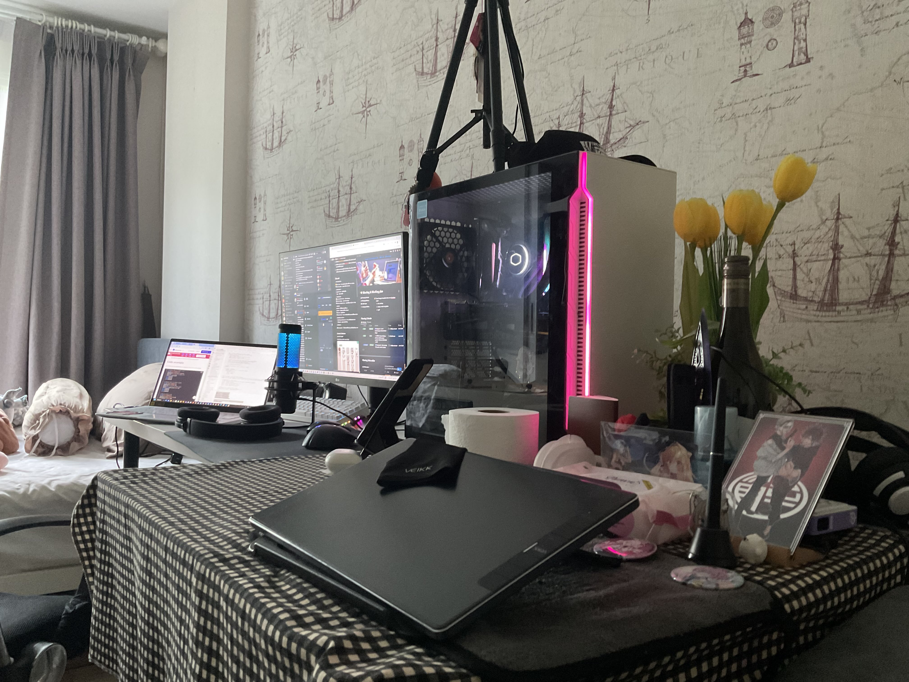

# Hi there! 👋

I'm a **Digital Engineering (DE) student** pursuing a Bachelor's degree with a deep passion for **Computer Vision (CV)** and **Machine Learning Engineering (MLE)**. I have aspirations to study abroad and connect with people from various cultures, using English as a global communication tool to bridge gaps and foster innovation. Currently, I'm interning at **Axons, CPF** as an MLE and MLOps engineer, where I'm actively contributing to multiple impactful projects.

## 🚀 What I'm Working On

### 🌟 Internship at Axons
- **MLOps & Machine Learning Engineering:**
  - **Pattern Design & Dependency Injection Frameworks:**  
    Contributed to developing multiple Dependency Injection frameworks with an Adapter Pattern Proof of Concept (POC). I’ve been fortunate to learn from a senior who is highly skilled and passionate about pattern design.
  - **Computer Vision (CV):**  
    Led the on-premise deployment of a bag-detection model, including performance testing on Vertex AI to determine optimal device specifications. This project also involved real-time video stream processing and developing business logic add-ons. I created and presented a detailed slide deck to AI lab users and remotely installed the system on the client’s site.  
    **Passion:** Being a CV-related MLE is my true passion, inspired by the K-drama series "Startup." Like Nam Do-san, I am driven to make impactful contributions in the field. I am particularly interested in self-driving cars and how they can revolutionize transportation.
  - **CI/CD & Clean Code Exercise:**  
    Engaged in CI/CD exercises using Azure DevOps to build FasAPI microservice endpoint into GCP artifact registry and deploy as private server into GCP Cloud Run, using docker enterprise version and json key file as credential, with a focus on applying **SOLID principles** and **Hexagonal Architecture** to maintain clean, maintainable code.
  - **ML Intensive Course:**  
    Participating in an intensive machine learning course to deepen my understanding of practical ML applications in the industry.

### 🎓 University Projects
- **Thesis on Multiple Sentiment Analysis:**  
  Currently conducting research on sentiment analysis, which is the focus of my university thesis.
- **Cloud-Based Systems, Pygame, Blockchain, AI, and Mobile App Development:**  
  Completed various projects during my academic journey, ranging from cloud-based systems to game development and blockchain technology.

## 🎨 Hobbies and Interests
Outside of my professional and academic pursuits, I enjoy drawing and streaming, especially on weekends. I’m currently working on building a dual-PC setup for streaming, where I can showcase my original character (OC) drawings and explore Live2D animation. However, I've had to put these hobbies on hold recently as I focus on growing in my job and balancing both work and study. Once everything settles, I plan to dive back into my creative passions.

## 🌱 My Vision
I’m curious and eager to explore various fields and technologies. I enjoy tackling new challenges and constantly learning. My passion for computer vision, especially in applications like self-driving cars, drives me to continually improve my skills. I aspire to be like Nam Do-san from "Startup," contributing to groundbreaking innovations in technology.

## 🌍 Upcoming Exchange Program
I'm excited to share that I will be participating in an exchange program next year at **Northumbria University** in Newcastle, UK. This opportunity will allow me to broaden my horizons, experience new cultures, and further my education in a global context.

---

Feel free to reach out if you want to connect, collaborate, or just chat! I'm always open to new opportunities and conversations.

---
