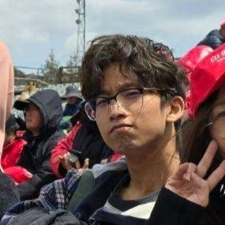

-# 👋 Hi there! Welcome to my GitHub!  🤓👆  

I’m **Teetawat (Mew) Bussabarati**, a creative technologist and aspiring **Cloud Engineer** with expertise in **Machine Learning Engineering (MLE/MLOps)**, **AR/VR**, and **Automation**. I’m passionate about blending **cutting-edge technology** with **innovative solutions** to create impactful and scalable systems.

---

## 🚀 About Me  

- 🎓 **Final Year Digital Engineering Student** at **Sirindhorn International Institute of Technology (SIIT), Thammasat University**, with a **GPA of 3.53**.  
- 💼 **Completed Internship** as a **Machine Learning Engineer** at **Axons, CPF**, focusing on **MLOps**, **Computer Vision**, and **CI/CD pipelines**.  
- 🌍 **Upcoming Exchange Program**: Excited to study **Software Architecture and AR/VR** at **Northumbria University, UK**, where I’ll explore immersive technologies and system design.  
- 🎨 **Creative Technologist**: Building side projects in **AI**, **IoT**, and **digital art** with a goal to merge tech, creativity, and fun.

---

## 💡 What I’ve Done  

### 🎓 **Academic Projects**  
- **AWS Cloud Foot Traffic Detection System**  
  - Built a **serverless, scalable system** for real-time foot traffic detection, leveraging **AWS Lambda, ECS Fargate**, and **RDS**.
  - Integrated a **real-time dashboard** to deliver insights for **retailers** and **event organizers**.
  - [Explore the project on GitHub](https://github.com/mewakinHub/Cloud-Foot-Traffic.git).

- **Database Image Retrieval Optimization**  
  - Developed a **high-speed image retrieval system** using **Redis** and **Sharp compression** to optimize query performance.

### 💼 **Internship at Axons (May 2024 - September 2024)**  
As a **Machine Learning Engineer Intern**, I contributed to several impactful projects:  
- **MLOps & Design Patterns**:  
  Designed a **SOLID model training pipeline** and integrated **Dependency Injection frameworks** with an **Adapter Pattern**.  
- **Computer Vision (Edge Devices)**:  
  Built and deployed a **real-time detection system** optimized for edge devices with seamless user interactions.  
- **CI/CD Pipelines**:  
  Automated workflows using **Azure DevOps**, applying **SOLID principles** for maintainable and modular pipelines.

---

## 🎯 What I’m Working On  

### **🌱 Preparing for Northumbria University**  
- Studying **Software Architecture** and **AR/VR technologies** to expand my expertise in immersive and scalable systems.  

### **🛠️ Exploring Side Projects**  
- Building an **interactive VTuber companion** with **AI-powered animation** and **IoT integration**.  
- Developing tools to automate **streaming workflows** and improve **content engagement** for creators.  

---

## 🎨 Hobbies & Interests  

- 🎮 **Streaming & Digital Art**: Creating and animating **Live2D avatars**, sharing my art, and exploring creative technologies.  
- 🤖 **Tech-Enhanced Creativity**: Experimenting with **IoT, Computer Vision**, and **AR/VR** to develop unique, innovative projects.  
- 📈 **Content Automation**: Building tools to simplify content creation and distribution using **AI** and **automation frameworks**.

---

## 📌 Let’s Connect!  

- 🌐 **Portfolio**: [GitHub Profile](https://github.com/mewakinHub)  
- 💬 **Email**: [teetawat.b@example.com](mailto:teetawat.b@example.com)  
- 💼 **LinkedIn**: [View My Profile](https://linkedin.com/in/teetawat-bussabarati)  

Feel free to reach out if you’re interested in **collaborations, tech innovations, or creative projects**. Let’s build something amazing together! 🚀  
